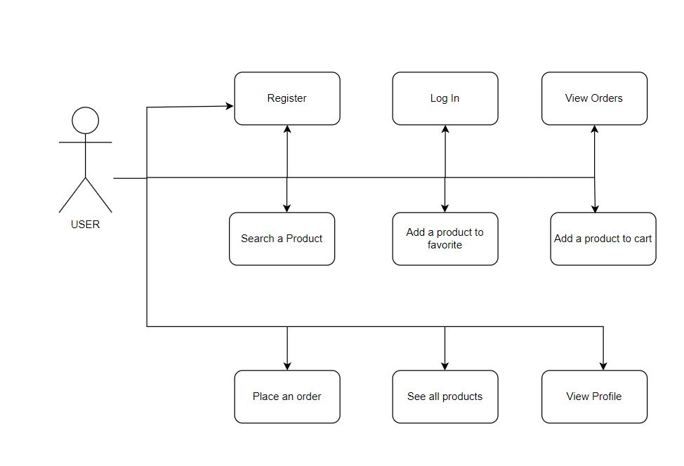
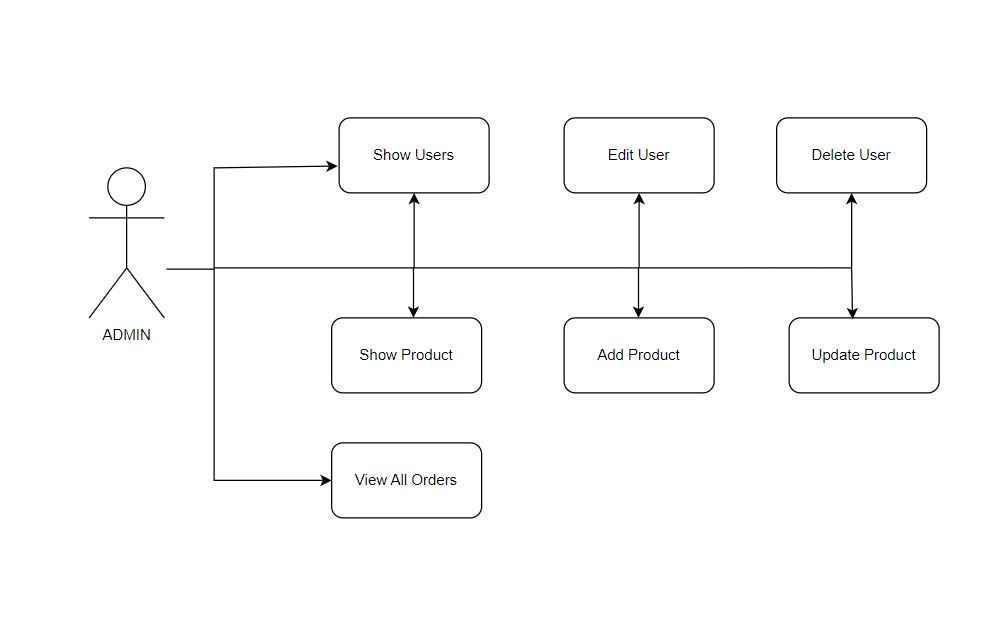
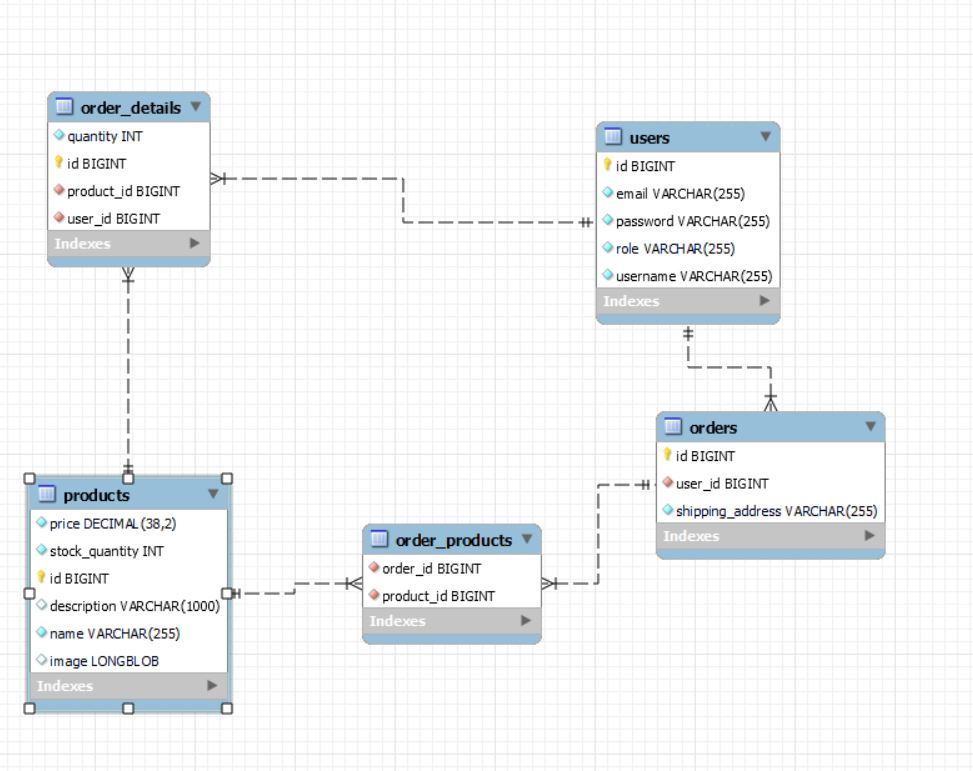
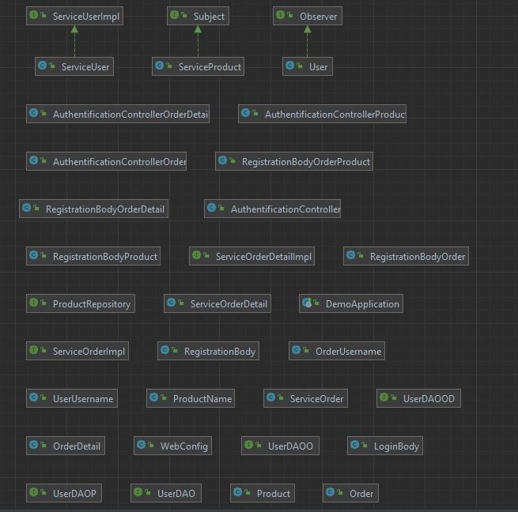

# Descrierea Proiectului: Magazin Online de Haine Second-Hand

## Scopul Proiectului
Scopul acestui proiect este de a dezvolta un magazin online de haine second-hand, care permite utilizatorilor să posteze anunțuri pentru hainele pe care doresc să le vândă și să cumpere hainele disponibile în magazin. Magazinul va oferi o platformă pentru utilizatori să navigheze, să căute și să cumpere haine second-hand de la diferiți vânzători.

## For Users
**Registration and Authentication**

- **Register**: Create a new account.
- **Log In**: Access an existing account.

**Account Management**

- **View/Update Personal Information**: Update details such as name, address, and contact information.
- **Change Password/Settings**: Modify password or other account settings.

**Browsing and Searching Products**

- **Browse Categories**: Explore different product categories.
- **Search Products**: Use the search bar to find specific products.

**Viewing Product Details**

- **View Product Information**: See descriptions, prices, images, and other product details.

**Adding Products to Cart**

- **Add to Cart**: Add products to the shopping cart.
- **Modify Cart**: Change the quantity of products or remove items from the cart.

**Placing Orders**

- **Place an Order**: Specify delivery details and choose a payment method.
- **Order History**: View past orders and the status of current orders.

  
## For Admin
# Admin Features

**Single Admin**

- **Admin Role**: There is currently only one admin.

**User Management**

- **View Users**: See the list of users and their account details.
- **Manage User Accounts**: Add, modify, or delete user accounts.

**Product Management**

- **Catalog Management**: Add, update, or delete products from the catalog.
- **Inventory and Pricing**: Manage inventory levels and update product prices.

**Order Management**

- **View Orders**: Access all orders placed by users.
- **Update Order Status**: Change the status of orders (e.g., confirmation, shipping, delivery).
 

## Backend
**Technologies used**
- **Spring Boot**
- **MySQL Database**
   
### API Endpoints
### User Endpoints
**GET /auth/users:**
 Returns a list of all users in the system.
 **GET /auth/user-details:**
 Returns details of the currently authenticated user.
 **POST /auth/register:**
 Registers a new user with the details.
 **GET /auth/find:**
  Finds a user
  **PUT /auth/update:**
  Updates the details of an existing user.(admin only)
  **DELETE /auth/delete:**
  Enables the deletion of an existing user (admin only).
  **POST /auth/login:**
  Authenticates a user's login credentials.
  ### Product Endpoints
**GET /authProduct/products:**
Returns a list of all products in the system.

**POST /authProduct/registerProduct:**
Registers a new product.

**GET /authProduct/findProduct:**
Finds a product based on the details provided in `RegistrationBodyProduct`.

**PUT /authProduct/updateProduct:**
Updates the details of an existing product .

**DELETE /authProduct/deleteProduct:**
Deletes a product based on the details.

**POST /authProduct/{id}/uploadImage:**
Uploads an image for a specific product identified by `{id}`.

**GET /authProduct/{id}/image:**
Retrieves the image of a specific product identified by `{id}`.

**GET /authProduct/search:**
Searches for products by name based on the query parameter `query`.

**GET /authProduct/{id}:**
Retrieves details of a specific product identified by `{id}`.

### Order Endpoints
**POST /authOrder/registerOrder:**
Registers a new order`.

**GET /authOrder/orders:**
Returns a list of all orders in the system.

**GET /authOrder/orders/user/{username}:**
Returns a list of orders for a specific user identified by `{username}`.
### Order Details Endpoints
**POST /authOrderDetail/registerOrderDetail:**
Registers a new order detail.

**GET /authOrderDetail/orderDetails/user/{username}:**
Returns a list of order details for a specific user identified by `{username}`.
 
## Frontend
**Technologies used**
- **React**
### User Authentication and Profile Management
At the heart of the online clothing store is a robust user authentication system. This system enables new users to register and create accounts, ensuring that personal information is securely stored and easily accessible. Upon logging in, users are greeted with their profile page, where they can update personal details such as their name, email address, and password. Additionally, users have access to their order history.

### Product Management
The core of the store’s offering lies in its product management capabilities. Users can browse through a comprehensive list of all available products, each presented with detailed information including images, descriptions, and pricing. The product listing feature ensures that customers can easily find what they are looking for, while the product details page provides in-depth information to aid their purchasing decisions. To enhance user experience, a search bar is integrated into the platform, allowing users to quickly find products by name or keyword. This search functionality is essential for a large inventory, ensuring that users can navigate the store efficiently.

### Shopping Cart and Wishlist
A key aspect of the online shopping experience is the ability to manage a shopping cart and wishlist. Users can add products to their shopping cart, view the contents of their cart at any time, and proceed to checkout when ready. This process is streamlined to ensure a smooth transition from browsing to purchasing. Additionally, the wishlist feature allows users to save products for future reference. This is particularly useful for customers who are not ready to make an immediate purchase but want to keep track of items they are interested in. The integration of these features enhances user convenience and promotes repeat visits to the store.

### Admin Functionalities
Administrators play a crucial role in maintaining the store’s operations, and the project includes a set of powerful admin functionalities to support this. Admins can add new products to the inventory, ensuring that the latest offerings are always available to customers. They can also edit existing products, updating details such as pricing, descriptions, and images to reflect current stock and promotions. Additionally, the ability to delete products ensures that outdated or unavailable items are removed from the store. Beyond product management, administrators have the capability to manage user accounts. This includes viewing user details, editing information, and deleting accounts if necessary. These admin functionalities are essential for maintaining an up-to-date and user-friendly store.

### Order Management
Managing orders is another critical component of the store’s functionality. Both administrators and users can view a comprehensive list of all orders. For users, this means being able to track their purchases and view order statuses. For administrators, it involves overseeing the entire order process, from purchase to delivery. Each order includes detailed information about the products ordered, quantities, and user information. This transparency ensures that orders are processed efficiently and any issues can be promptly addressed.

### Navigation and Layout
The application’s navigation and layout are designed to provide a cohesive and intuitive user experience. The sidebar and dashboard offer easy navigation between different sections of the application, ensuring that users can find what they need without hassle. The consistent layout across all pages helps maintain a uniform look and feel, making the store both aesthetically pleasing and easy to navigate.

### Project Structure
The project’s structure is organized to separate concerns and enhance maintainability. The Components directory houses all React components, each categorized by functionality. This includes separate folders for admin functionalities, product details, user dashboards, and more. The Assets directory is used for static assets like images, ensuring that resources are easily accessible and organized. Additionally, the Context directory leverages React Context API to manage state for the shopping cart and wishlist, providing a centralized and efficient state management solution.
## Tests
ServiceOrderTest Overview
1. Setup Method (setup()):

Initializes mocks and a ServiceOrder instance before each test.
2. Register Order Test (registerOrderTest()):

Verifies the registration and correct saving of an order using mock interactions.
3. Find Order Test (findOrderTest()):

Checks if the correct method is called on the mock to find an order by username.
4. Delete Order Test (deleteOrderTest()):

Ensures that the correct delete method is invoked on the mock for an order.
5. Update Order Test (updateOrderTest()):

Confirms that the update functionality correctly interacts with the mock to find and update an order.
6. Find User by Username Test (findUserByUsernameTest()):

Tests the retrieval of a user by username to verify the correct functioning of the findByUsername method on the mock.
These tests are designed to validate the behavior of the ServiceOrder class using Mockito to simulate database interactions and ensure methods are called as expected.

ServiceProductTest Overview
1. Setup Method (setup()):

Purpose: Prepares mocks and a ServiceProduct instance before each test run, ensuring a consistent testing environment.
2. Register Product Test (registerProductMethodTest()):

Purpose: Validates the registration process of a product, ensuring it is correctly saved using mocked DAO interactions.
3. Find Product by Name Test (findProductMethodTest()):

Purpose: Checks the functionality of retrieving a product by name, verifying correct method calls on the mocked DAO.
4. Delete Product Test (deleteProductTest()):

Purpose: Ensures that the deletion process of a product is handled correctly, with the appropriate DAO method being invoked.
5. Update Product Test (updateProductTest()):

Purpose: Tests the update functionality for a product's details, confirming correct interactions with the DAO and accurate data handling.
6. Find User by Product Name Test (findUserByNameTest()):

Purpose: Verifies the process of finding a product by its name, ensuring the DAO's findByName method is correctly utilized.
These tests rigorously check the product management functions, simulating database operations using Mockito to confirm that each method performs as expected within the ServiceProduct class.

ServiceUserTest Overview

1. Setup Method (setup()):

Purpose: This method prepares the test environment by initializing all necessary mocks and creating an instance of ServiceUser. It is critical for setting a clean slate before each test to ensure that test outcomes are not influenced by previous tests.
Details: MockitoAnnotations.initMocks(this); is used to automatically set up the mocked objects annotated with @Mock. serviceUser = new ServiceUser(userDAOmock); initializes the ServiceUser with a mock DAO object, allowing for controlled testing of database operations.
2. Register User Test (registerUserTest()):

Purpose: Ensures that the user registration functionality works as expected. The test confirms that a new user is saved correctly and the saved data matches the provided input.
Details:
Input: RegistrationBody containing user details like email, username, password, and role.
Operation: Simulates the registration process and intercepts the DAO's save operation to validate both input handling and persistence logic.
Verification: Checks that the returned user object is as expected and verifies that the save method on the mocked DAO was called with the correct parameters.
3. Find User Test (findUserTest()):

Purpose: Tests the ability of the service to retrieve a user by username from the database, ensuring that the correct database access method is invoked.
Details:
Operation: Triggers the find functionality within the service which should then call the DAO's find method.
Verification: Uses Mockito's verify method to ensure that findByUsername was called on the mock DAO, validating that the service delegates the database operations correctly.
4. Update User Test (updateUserTest()):

Purpose: Validates that the user's information can be updated correctly, with proper interaction with the DAO for both fetching and updating the user data.
Details:
Operation: First retrieves a user based on username and then attempts to update that user's details.
Verification: Verifies both the retrieval (findByUsername) and update (save) operations on the DAO, ensuring that the service handles the flow of operations correctly.
5. Delete User Test (deleteUserTest()):

Purpose: Confirms that the service can delete a user correctly, with the DAO's delete method being properly invoked.
Details:
Operation: Simulates the deletion of a user and checks that the correct user object is used in the DAO's delete method.
Verification: Ensures that the delete method is called on the mock DAO, confirming that the service correctly translates business operations into data layer operations.
6. Find User by Username Test (findUserByUsernameTest()):

Purpose: Tests the functionality to retrieve a user by their username, ensuring that the method on the DAO is appropriately called.
Details:
Operation: Specifically tests the findUserByUsername method of the service, focusing on DAO interaction.
Verification: Confirms that findByUsername is executed on the DAO mock, ensuring that the service accurately queries the data layer based on user input.
These detailed test descriptions provide a comprehensive overview of how ServiceUserTest ensures the correctness and efficiency of user management functionalities within the service layer, validating the integrity of operations like registration, update, deletion, and retrieval of user data.

